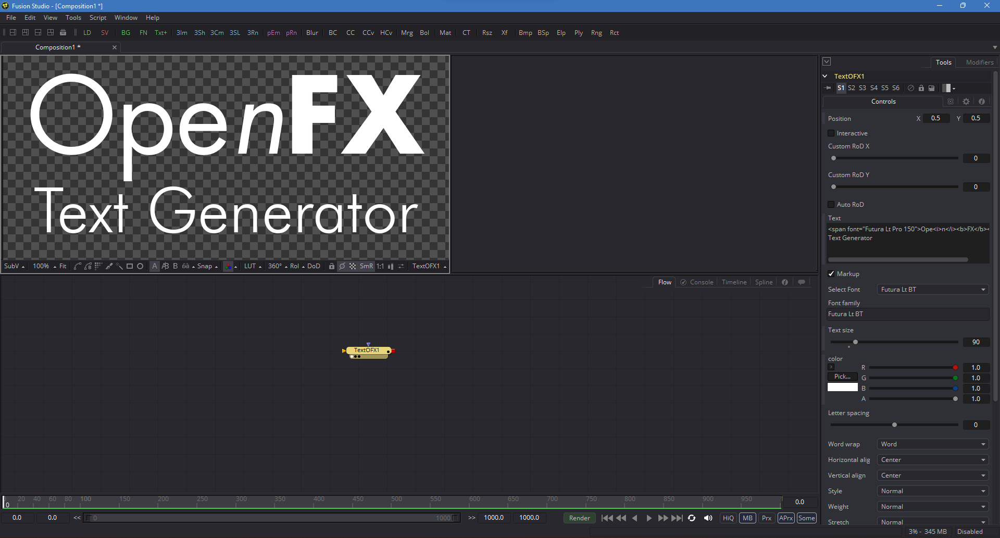

# OpenFX Text Generator

Advanced text generator for motion graphics and VFX software using the [OpenFX](http://openeffects.org/) standard.

*Under development (beta), first public release will be available by the end of July 2022.*

## Compatibility

Supported OpenFX host applications:

* [The Foundry](https://www.foundry.com/) [Nuke](https://www.foundry.com/products/nuke) *7+*
* [Blackmagic Design](https://blackmagicdesign.com) [DaVinci Resolve](https://www.blackmagicdesign.com/products/davinciresolve) (Studio) *15+*
* [Blackmagic Design](https://blackmagicdesign.com) [Fusion](https://www.blackmagicdesign.com/no/products/fusion) (Studio) *9+*
* [Natron](https://natrongithub.github.io/) *2+*
* [Sony](https://www.sonycreativesoftware.com/)/[Magix](https://www.magix.com/) [Vegas](https://www.vegascreativesoftware.com/) (Pro) *12+*

## Screenshots

*TextOFX 1.0 beta in DaVinci Resolve 17 Edit page*

*TextOFX 1.0 beta in DaVinci Resolve 17 Fusion page*

*TextOFX 1.0 beta in Fusion Studio 9*

*TextOFX 1.0 beta in Nuke 7*

## Support

We have a public community forum hosted on [GitHub](https://github.com/nettstudio/text.openfx.no/discussions).
