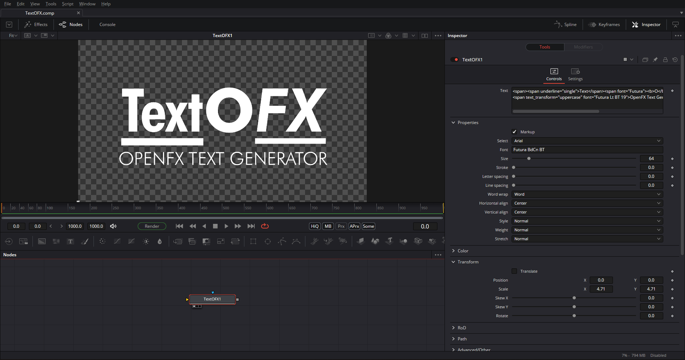
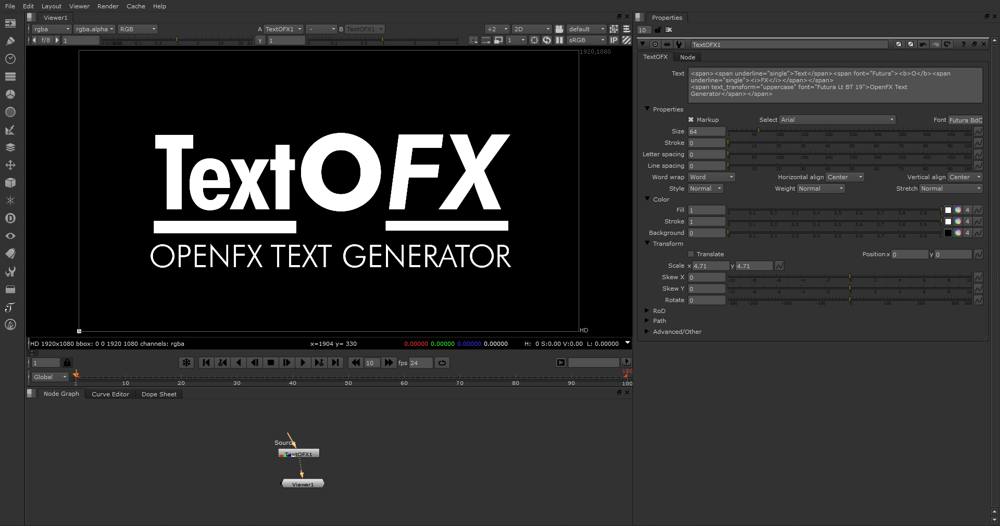

<a class="gumroad-button" href="https://rodlie.gumroad.com/l/spjxu">Get TextOFX on</a>

## Compatibility

* [Nuke](https://www.foundry.com/products/nuke) by [The Foundry](https://www.foundry.com/)
* [Fusion](https://www.blackmagicdesign.com/no/products/fusion) by [Blackmagic Design](https://blackmagicdesign.com)
* [DaVinci Resolve](https://www.blackmagicdesign.com/products/davinciresolve) by [Blackmagic Design](https://blackmagicdesign.com)
* [Natron](https://natrongithub.github.io/)

## Support

We have a community forum hosted on [GitHub](https://github.com/nettstudio/text.openfx.no/discussions).
