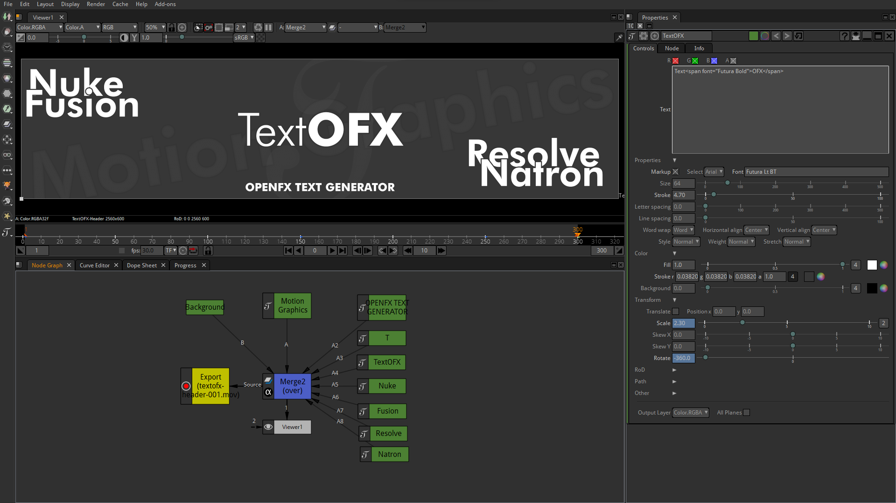

# OpenFX Text Generator

TextOFX is an advanced text generator image effect for motion graphics and VFX software using the [OpenFX](http://openeffects.org/) standard published by the [Academy Software Foundation](https://www.aswf.io).

**Under development, will be available by the end of August 2022.**

## Compatibility

* [Nuke](https://www.foundry.com/products/nuke) by [The Foundry](https://www.foundry.com/)
* [Fusion](https://www.blackmagicdesign.com/no/products/fusion) by [Blackmagic Design](https://blackmagicdesign.com)
* [DaVinci Resolve](https://www.blackmagicdesign.com/products/davinciresolve) by [Blackmagic Design](https://blackmagicdesign.com)
* [Natron](https://natrongithub.github.io/)

## Support

We have a community forum hosted on [GitHub](https://github.com/nettstudio/text.openfx.no/discussions).

## Controls

ID | Label | Description
--- | --- | ---
``text`` | **Text** | The text that will be drawn.

### Properties

Main properties for the text layout.

ID | Label | Description
--- | --- | ---
``markup`` | **Markup** | Parse text as [Pango Text Attribute Markup Language](https://docs.gtk.org/Pango/pango_markup.html).
``name`` | **Select** | Select the font family to be used.
``font`` | **Font** | Font family in use.
``size`` | **Size** | Font size in pixels.
``strokeSize`` | **Stroke** | Stroke size.
``letterSpace`` | **Letter spacing** | Spacing between letters.
``lineSpace`` | **Line spacing** | Spacing between lines.
``wrap`` | **Word wrap** | Wrap the lines to the desired width.
``halign`` | **Horizontal align** | Horizontal text align.
``valign`` | **Vertical align** | Vertical text align.
``style`` | **Style** | Font family style.
``weight`` | **Weight** | The weight field specifies how bold or light the font should be.
``stretch`` | **Stretch** | Width of the font relative to other designs within a family.

### Color

The fill color (RGBA) for the text, stroke and background.

ID | Label | Description
--- | --- | ---
``color`` | **Fill** | The text fill color.
``strokeColor`` | **Stroke** | The stroke fill color.
``backgroundColor`` | **Background** | The background fill color.

### Transform

Transform the text layout in various ways.

ID | Label | Description
--- | --- | ---
``translate`` | **Translate** | Enable translate.
``position`` | **Position** | Custom position of the text layout, if translate is enabled.
``scale`` | **Scale** | Scale the text layout.
``skewX`` | **Skew X** | Skew the text layout *(X)*.
``skewY`` | **Skew Y** | Skew the text layout *(Y)*.
``rotate`` | **Rotate** | Rotate the text layout.

### RoD

The region of definition for an image effect is the rectangular section of the 2D image plane that it is capable of filling. The default is project format or source input.

ID | Label | Description
--- | --- | ---
``customRoD`` | **Custom RoD** | Set custom RoD size.
``autoRoD`` | **Auto RoD** | Set RoD size based on the text layout.

### Path *(experimental)*

Text-to-path is an experimental feature and may change at any time. It should not be used in production, only for testing/feedback.

ID | Label | Description
--- | --- | ---
``pathAdd`` | **Add** | Add current position to path.
``pathClear`` | **Clear** | Clear paths.
``pathType`` | **Type** | Path type.
``pathPreview`` | **Preview** | Preview paths *(draw lines)*.
``paths`` | **Paths** | Paths in use.

### Advanced/Other

ID | Label | Description
--- | --- | ---
``glyphs`` | **Glyphs** | Render glyphs. Should not be used during animation.
``hintStyle`` | **Hint style** | This controls whether to fit font outlines to the pixel grid, and if so, whether to optimize for fidelity or contrast. Should not be used during animation.
``hintMetrics`` | **Hint metrics** | This controls whether metrics are quantized to integer values in device units. Should not be used during animation.
``frameRange`` | **Frame Range** | Time domain.
